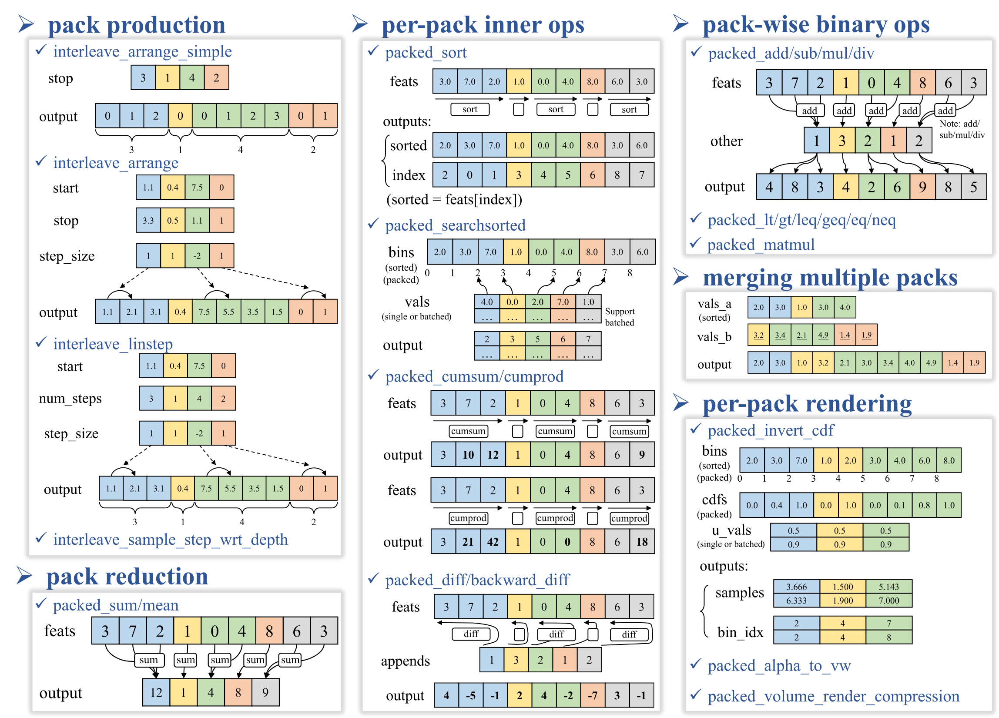
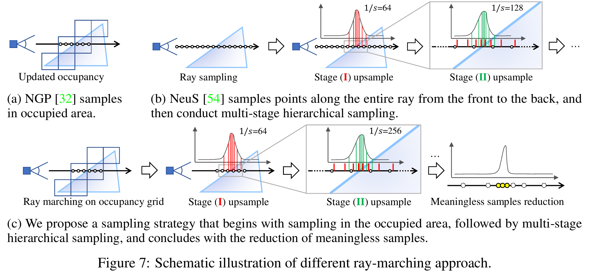
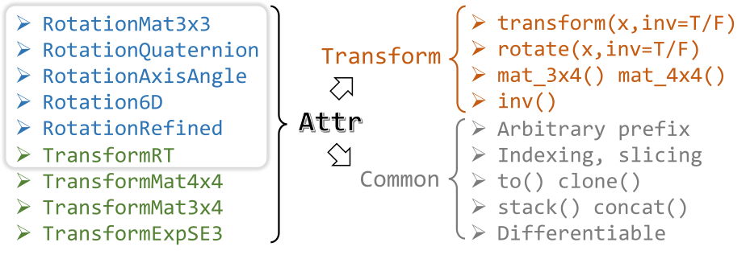
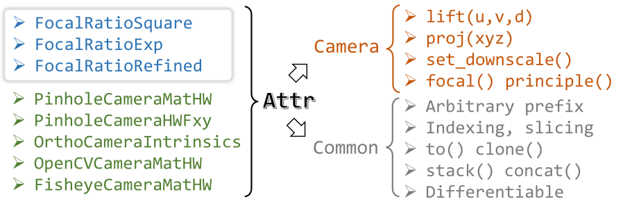

#  nr3d_lib

Modules, operators and utilities for 3D neural rendering in single-object, multi-object, categorical and large-scale scenes.

Pull requests and collaborations are warmly welcomed :hugs:! Please follow our code style if you want to make any contribution.

Feel free to open an issue or contact [Jianfei Guo](https://ventusff.github.io/) at ffventus@gmail.com if you have any questions or proposals.

## Installation

### Requirements

- python >= 3.8
- Pytorch >= 1.10 && !=1.12 && <2.0
- [CUDA dev](https://developer.nvidia.com/cuda-toolkit-archive) >= 10.0
  - need to match the major CUDA version that your Pytorch built with

An example of our platform (python=3.8, pytorch=1.11, cuda=11.3 / 11.7): 

```shell
conda create -n nr3d python=3.8
conda activate nr3d
conda install pytorch==1.11.0 torchvision==0.12.0 torchaudio==0.11.0 cudatoolkit=11.3 -c pytorch
```

- pytorch_scatter

```shell
conda install pytorch-scatter -c pyg
```

- other pip packages

```shell
pip install opencv-python-headless kornia imagesize omegaconf addict imageio imageio-ffmpeg scikit-image scikit-learn pyyaml pynvml psutil seaborn==0.12.0 trimesh plyfile ninja icecream tqdm plyfile tensorboard
```

### One-liner install

`cd` to the `nr3d_lib` directory, and then: (Notice the trailing dot `.`)

```shell
pip install -v .
```

<details>
<summary>Optional functionalities</summary>

- Visualization


  - `pip install open3d vedo==2023.4.6 mayavi`

- tiny-cuda-nn backends


  - `pip install git+https://github.com/NVlabs/tiny-cuda-nn/#subdirectory=bindings/torch`

- GUI support (Experimental)


  - ```shell
    # opengl
    pip install pyopengl
    
    # imgui
    pip install imgui
    
    # glumpy
    pip install git+https://github.com/glumpy/glumpy.git@46a7635c08d3a200478397edbe0371a6c59cd9d7#egg=glumpy
    
    # pycuda
    git clone https://github.com/inducer/pycuda
    cd pycuda
    ./configure.py --cuda-root=/usr/local/cuda --cuda-enable-gl
    python setup.py install
    ```

</details>

## Main components

- [LoTD](#lotd)  Levels of Tensorial Decomposition
- [pack_ops](#pack_ops)  Pack-wise operations for packed tensors
- [occ_grids](#occ_grids)  Occupancy accelerates ray marching
- [attributes](#attr)  Unified API framework for scene node attributes
- [fields](#fields)  Implicit representations

### :pushpin: [LoTD]: Levels of Tensorial Decomposition <a name="lotd"></a>

- Code: [models/grids/lotd](models/grids/lotd)
- Supported scenes: 

  - [x] Single scene

  - [x] Batched / categorical scene;  (LoTD-Growers to be released in Aug. 2023)

  - [ ] Large-scale scene (To be released: Sept. 2023)
- Main feature

  - Support **different layer using different types**
  - Support different layer using **different widths (n_feats)**
  - All types support **cuboid resolutions**
  - All types support forward, first-order gradients and **second-order gradients**
  - All types support **batched encoding**: inference with batched inputs or batch_inds
  - [To be released] All types support large-scale scene representation
- Supported LoTD Types and calculations of forward, gradients (`dLd[]`) and second-order gradients (`d(dLdx)d[]`)

| :rocket: All implemented with Pytorch-CUDA extension         | dimension | forward            | dL<br />dparam     | dL<br />dx         | d(dLdx)<br />d(param) | d(dLdx)<br />d(dLdy) | d(dLdx)<br />dx    |
| ------------------------------------------------------------ | --------- | ------------------ | ------------------ | ------------------ | --------------------- | -------------------- | ------------------ |
| `Dense`                                                      | 2-4       | :white_check_mark: | :white_check_mark: | :white_check_mark: | :white_check_mark:    | :white_check_mark:   | :white_check_mark: |
| `Hash`<br />hash-grids in [NGP](https://github.com/NVlabs/instant-ngp) | 2-4       | :white_check_mark: | :white_check_mark: | :white_check_mark: | :white_check_mark:    | :white_check_mark:   | :white_check_mark: |
| `VectorMatrix` or `VM`<br />Vector-Matrix in [TensoRF](https://apchenstu.github.io/TensoRF/) | 3         | :white_check_mark: | :white_check_mark: | :white_check_mark: | :white_check_mark:    | :white_check_mark:   | :white_check_mark: |
| `VecZMatXoY`<br />modified from [TensoRF](https://apchenstu.github.io/TensoRF/)<br />using only `xoy` mat and `z` vector. | 3         | :white_check_mark: | :white_check_mark: | :white_check_mark: | :white_check_mark:    | :white_check_mark:   | :white_check_mark: |
| `CP`<br />CP in [TensoRF](https://apchenstu.github.io/TensoRF/) | 2-4       | :white_check_mark: | :white_check_mark: | :white_check_mark: | :white_check_mark:    | :white_check_mark:   | :white_check_mark: |
| `NPlaneSum`<br />"TriPlane" in [EG3D](https://nvlabs.github.io/eg3d/) | 3-4       | :white_check_mark: | :white_check_mark: | :white_check_mark: | :white_check_mark:    | :white_check_mark:   | :white_check_mark: |
| `NPlaneMul`                                                  | 3-4       | :white_check_mark: | :white_check_mark: | :white_check_mark: | :white_check_mark:    | :white_check_mark:   | :white_check_mark: |

- A demo config yaml with all cubic resolution:

```yaml
lod_res:     [32,    64,    128, 256, 512, 1024, 2048, 4096]
lod_n_feats: [4,     4,     8,   4,   2,   16,    8,    4]
lod_types:   [Dense, Dense, VM,  VM,  VM,  CP,   CP,   CP]
```

- A demo config yaml with all cuboid resolution (usually **auto-computed** in practice):

```yaml
lod_res:  [[144, 56, 18], [199, 77, 25], [275, 107, 34], [380, 148, 47], [525, 204, 65], [726, 282, 91], [1004, 390, 126], [1387, 539, 174]]
lod_n_feats: [4, 4, 4, 4, 2, 2, 2, 2]
lod_types: [Dense, Dense, Hash, Hash, Hash, Hash, Hash, Hash]
log2_hashmap_size: 19
```

### :pushpin: [pack_ops]: Pack-wise operations for packed tensors <a name="pack_ops"></a>

Check out [docs/pack_ops.md](docs/pack_ops.md) for more!

Code: [render/pack_ops](render/pack_ops)



### :pushpin: [occ_grids] Occupancy accelerates ray marching <a name="occ_grids"></a>

Code: [render/raymarch/occgrid_raymarch.py](render/raymarch/occgrid_raymarch.py)

This part is primarily borrowed and modified from [nerfacc](https://github.com/KAIR-BAIR/nerfacc/tree/master/nerfacc)

- [x] Support single scene
- [x] Support batched / categorical scene
- [ ] Support large-scale scene (To be released: Sept. 2023)


#### Highlight implementations

- Efficient multi-stage hierarchical ray marching on occupancy grids
  - introduced in [StreetSurf](https://ventusff.github.io/streetsurf_web/) paper section 4.1
  - implementation in [models/fields/neus/renderer_mixin.py](models/fields/neus/renderer_mixin.py)
  - batched implementation in [models/fields_conditional/neus/renderer_mixin.py](models/fields_conditional/neus/renderer_mixin.py)
  - large-scale implementation is still WIP...
  

### :pushpin: [attributes]: Unified API framework for scene node attributes <a name="attr"></a>

Code: [models/attributes](models/attributes)

We extend `pytorch.Tensor` to represent common types of data involved in 3D neural rendering, e.g. transforms (SO3, SE3) and camera models (pinhole, OpenCV, fisheye), in order to eliminate concerns for tensor shapes, different variants and gradients and only expose common APIs regardless of the underlying implementation.

|  |  |
| -------------------------------------------- | -------------------------------------- |

These data types could have multiple variants but with the same way to use. For example, SE3 can be represented by RT matrices, 4x4 matrix, or exponential coordinates, and let alone the different representations of the underlying SO3 (quaternions, axis-angles, Euler angles...) when using RT as SE3. But when it comes to usage, the APIs are the same, e.g. `transform()`, `rotate()`, `mat_3x4()`, `mat_4x4()`, `inv()`, default transform, etc. In addition, there could also be complex data prefix like `[4,4]` or `[B,4,4]` or `[N,B,4,4]` etc. Once implemented under our framework and settings, you need only care about the APIs and can forget all the underlying calculations and tensor shape rearrangements.

You can check out `models/attributes/transform.py` for better understanding. Another example is `models/attributes/camera_param.py`.

Most of the basic `pytorch.Tensor` operations are implemented for `Attr` and `AttrNested`, e.g. slicing (support arbitrary slice with `:` and `...`), indexing, `.to()` , `.clone()`, `.stack()`, `.concat()`. Gradient flows and `nn.Parameters()`, `nn.Buffer()` are also kept / supported if needed.

### :pushpin: [fields]: Implicit representations <a name="fields"></a>

#### `fields`: single scene

Code: [models/fields](models/fields)

- `sdf`

  - LoTD-SDF

  - MLP-SDF

- `neus`

  - LoTD-NeuS

  - MLP-NeuS

  - [models/fields/neus/renderer_mixin.py](models/fields/neus/renderer_mixin.py) Multi-stage hierarchical sampling on occupancy grids

- `nerf` & `nerf_distant` (codes in [models/fields_distant](models/fields_distant))
- LoTD-NeRF/NeRF++
  
- MLP-NeRF/NeRF++

#### `fields_conditional`: conditional / categorical fields

Code: [models/fields_conditional](models/fields_conditional)

- [ ] To be released

#### `fields_forest`: large-scale fields

Code: [models/fields_forest](models/fields_forest)

- [ ] To be released

### Other highlights

- [plot](plot)  2d & 3d plotting tools for developers
- [models/importance.py](models/importance.py)  errormap update & 2D importance sampling (inverse 2D cdf sampling);  modified from [NGP](https://github.com/NVlabs/instant-ngp) and re-implemented in PyTorch 

## TODO

- [x] Release batched ray marching
- [ ] Release LoTD-Growers and Style-LoTD-NeuS
- [ ] Release large-scale representation, large-scale ray marching and large-scale neus
- [ ] Implement dmtet
- [ ] Implement permuto-SDF
- [ ] Basic examples & tutorials
  - [ ] How to use single / batched / large-scale LoTD
  - [ ] Example on batched ray marching & batched LoTD inference
  - [ ] Example on efficient multi-stage hierarchical sampling based on occupancy grids


## Acknowledgements

- [kaolin](https://github.com/NVIDIAGameWorks/kaolin)
- [nerfacc](https://github.com/KAIR-BAIR/nerfacc)
- [Instant-NGP](https://github.com/NVlabs/instant-ngp)
- [tiny-cuda-nn](https://github.com/NVlabs/tiny-cuda-nn)
- [tensoRF](https://apchenstu.github.io/TensoRF/)

## Citation

If you find this library useful, please cite our paper introducing pack_ops, cuboid hashgrids and efficient neus rendering.

```bibtex
@article{guo2023streetsurf,
  title = {StreetSurf: Extending Multi-view Implicit Surface Reconstruction to Street Views},
  author = {Guo, Jianfei and Deng, Nianchen and Li, Xinyang and Bai, Yeqi and Shi, Botian and Wang, Chiyu and Ding, Chenjing and Wang, Dongliang and Li, Yikang},
  journal = {arXiv preprint arXiv:2306.04988},
  year = {2023}
}
```