# Pack-ops

To produce and deal with non-matrix & packed data, and efficiently perform per-pack or pack-wise operations with Pytorch-CUDA exentions.

## Basic concepts

### Packed tensors and `pack_infos`

`Pytorch` deals with matrix tensors, i.e. batched data with the same data size on each batch. 

However, there are situations where we have to deal with non-matrix data with different data size on each batch (or, as named by [kaolin](https://github.com/NVIDIAGameWorks/kaolin) "nuggets"). This is especially the case for efficient 3D neural rendering in which each batch or "nuggets" represents buffer data of each ray.

Hence, we develop a toolbox for such needs, trying our best to deal with pack production, pack reduction, per-pack operations and so on. 

We acknowledge that the current repository does not cover all required use cases, and our implementations are still far from complete. Therefore, **any collaboration or pull-requests are warmly welcomed !** :hugs:

| batched data                                          | packed data ("nuggets" in [kaolin](https://github.com/NVIDIAGameWorks/kaolin)) |
| ----------------------------------------------------- | ------------------------------------------------------------ |
| 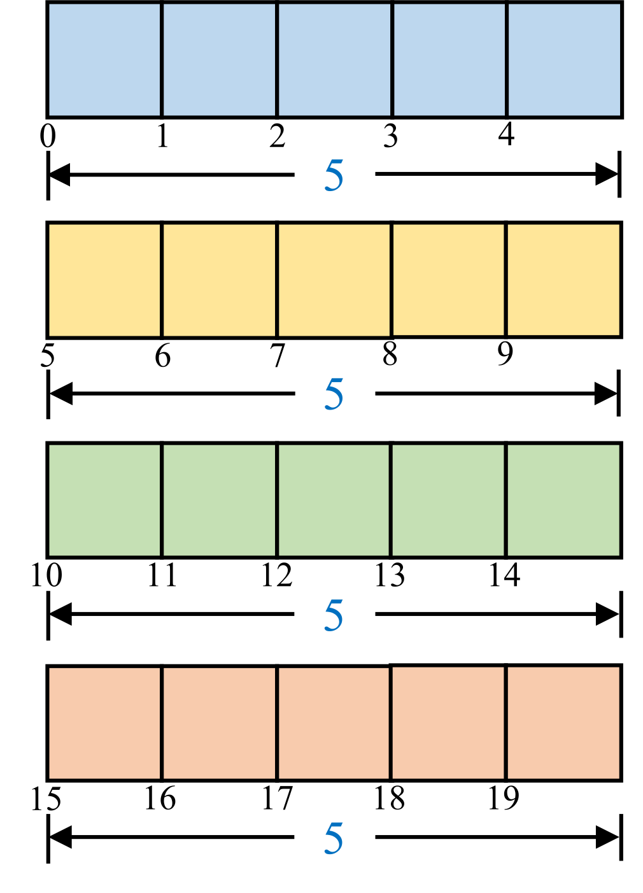             | 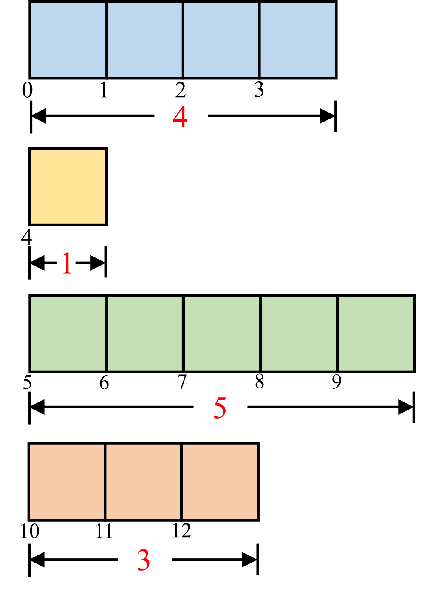                    |
| batch infos: batch_size=4 batch_data_size=5 | `pack_infos`: `torch.tensor([[0,4],[4,1],[5,5],[10,3]])` which means: `first_inds = pack_infos[:,0] = [0,4,5,10]` `lengths = pack_infos[:,1] = [4,1,5,3]`  |

## Supported ops

### interleave ops

interleave_arange_simple

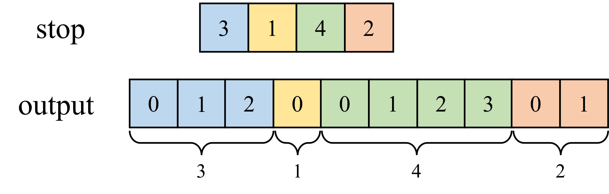

interleave_arange

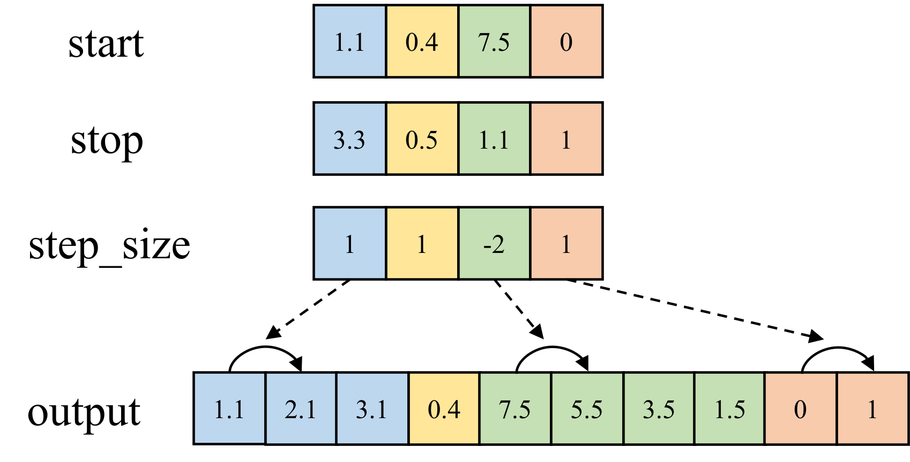

interleave_linstep

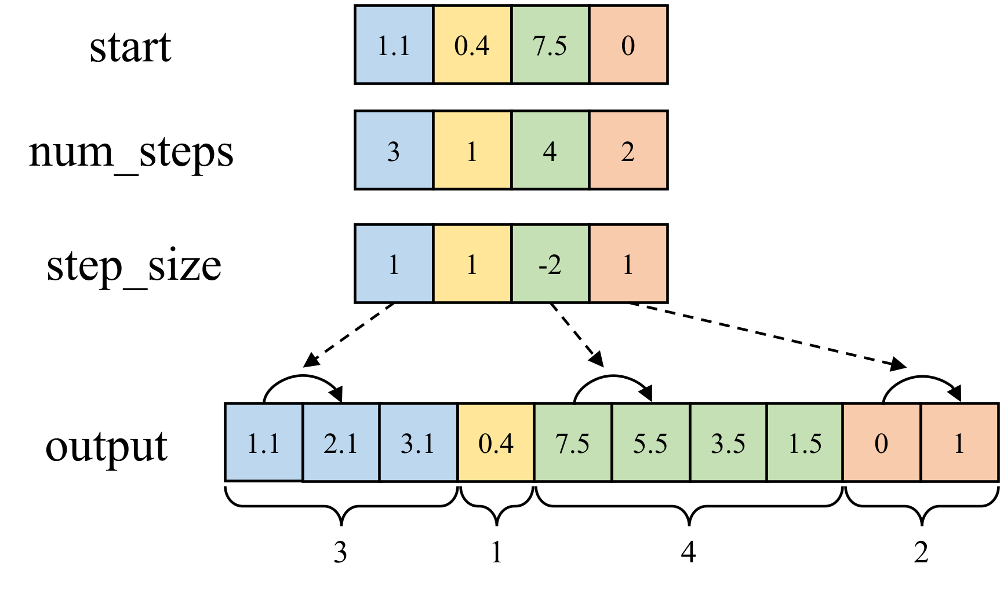

### packed_add/sub/mul/div [differentiable]

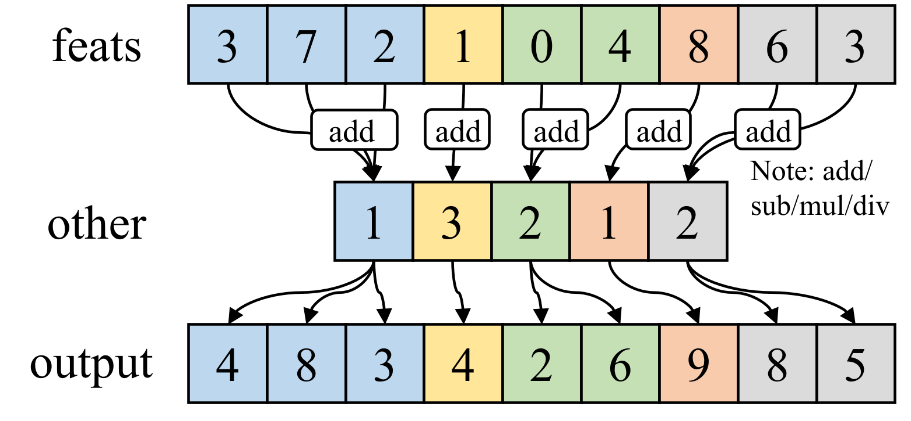

### packed_sum / mean [differentiable]

implementations are borrowed from [kaolin](https://github.com/NVIDIAGameWorks/kaolin)

packed_sum

packed_mean

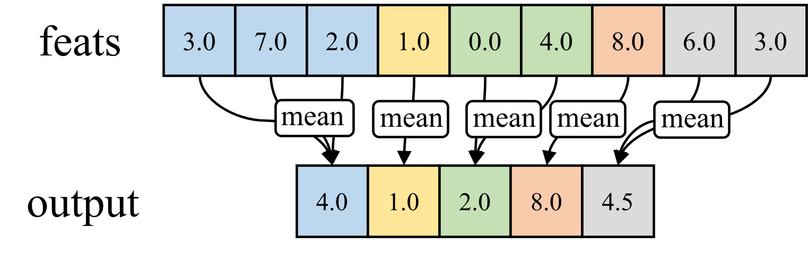

### packed_cumsum / cumprod [differentiable]

implementations are borrowed from [kaolin](https://github.com/NVIDIAGameWorks/kaolin)

packed_cumsum

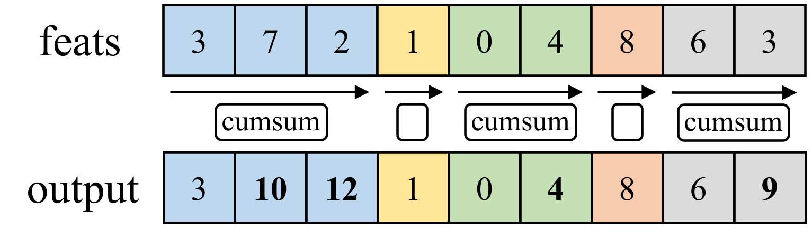

packed_cumprod

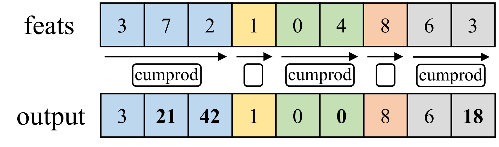

### packed_diff [differentiable]

`packed_diff`

forward difference:

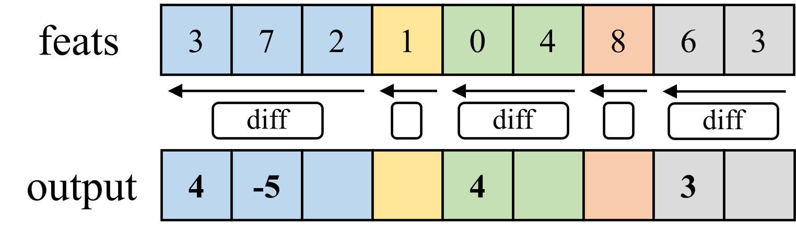

`packed_diff(feats, appends=...)`

forward difference with appends:

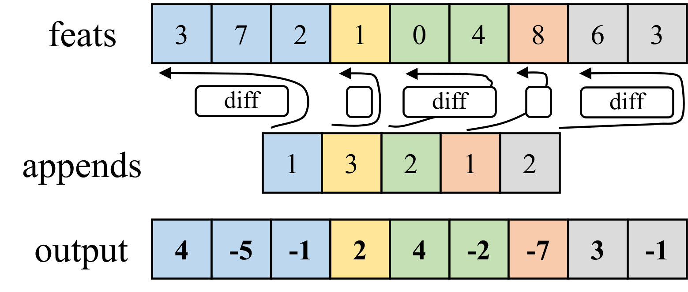

`packed_backward_diff(feats, prepends=...)`

backward difference with prepends:

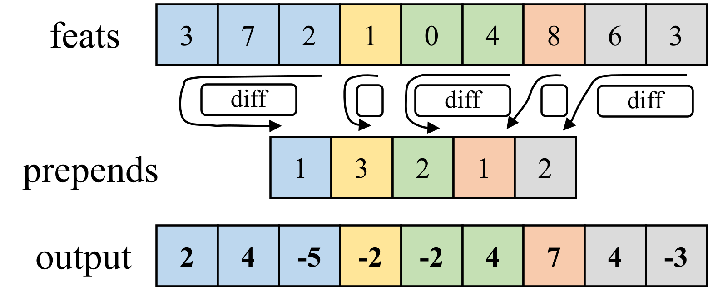

### packed_sort

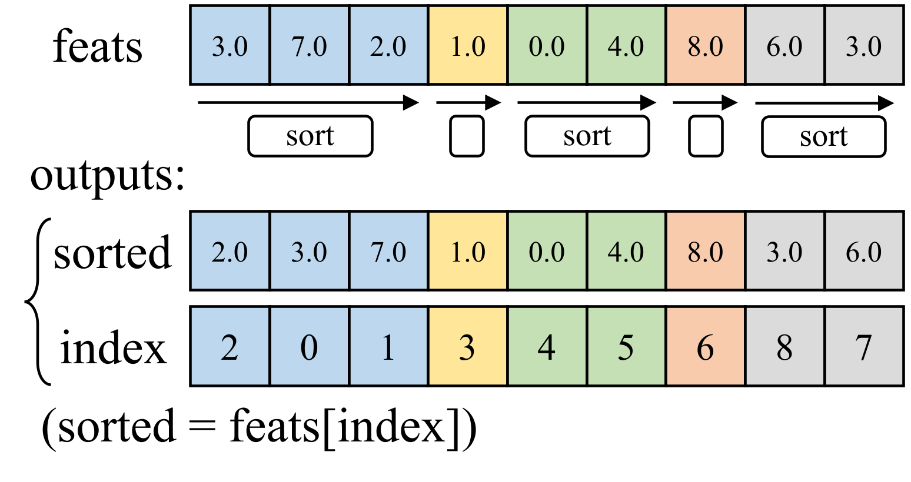

### packed_searchsorted / search_sorted_packed

packed_searchsorted

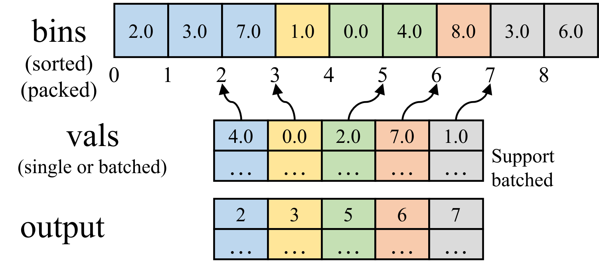

packed_searchsorted_packed_vals

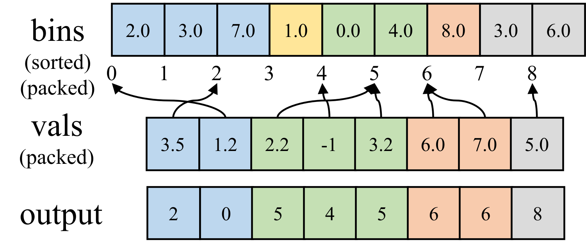

### packed_invert_cdf

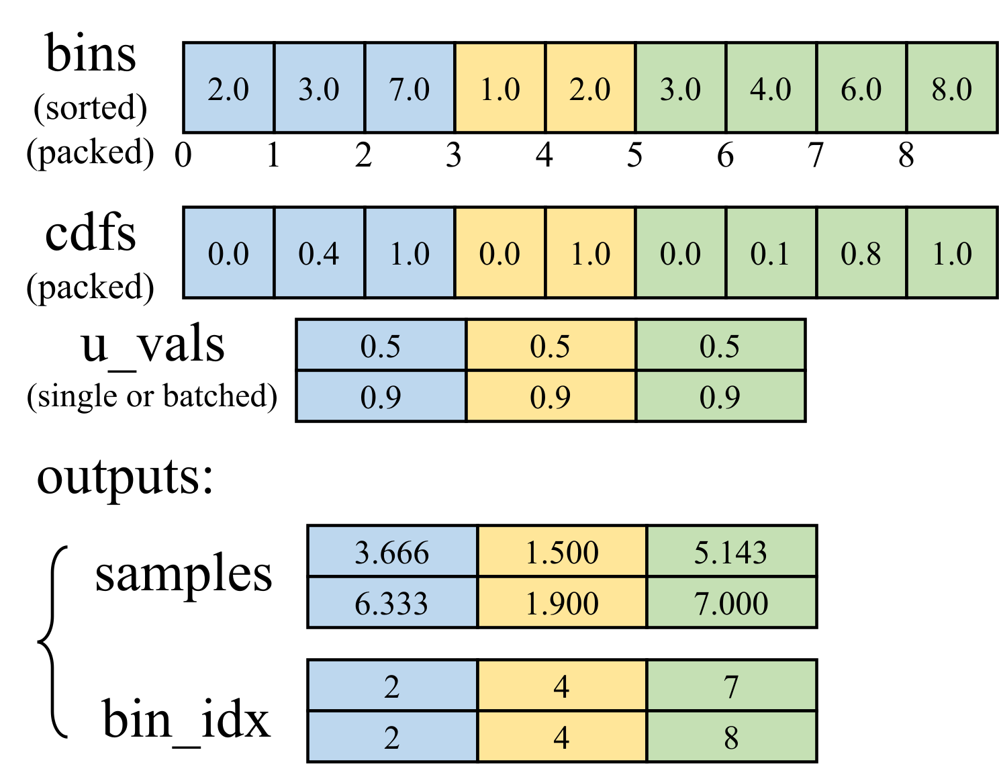

### merging two sorted packs

You achieve multiple packs merging via `packed_sort`. 

However, If you are only merging two packs with one of them already sorted, it's faster to use APIs here since they are based on `searchsorted` which is faster than general sorting.

`merge_two_packs_sorted_aligned`

Merge two packs with aligned nuggets

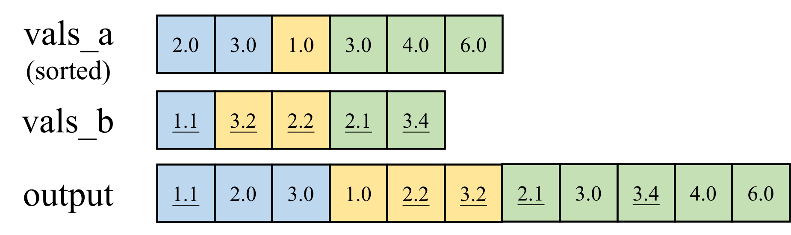

`merge_two_packs_sorted_a_includes_b`

Merge two packs with not aligned nuggets, but a's nuggets includes b's nuggets.

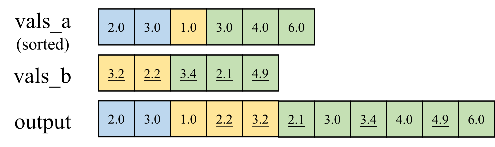

`merge_two_packs_sorted`

Merge two packs with intersecting nuggets. 

NOTE: The unique nuggets of `b` must be sorted in advance since their orders will be untouched.

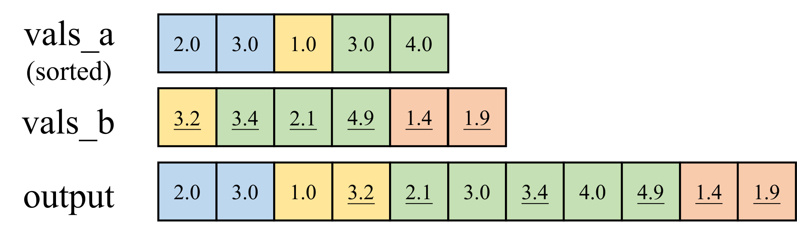

